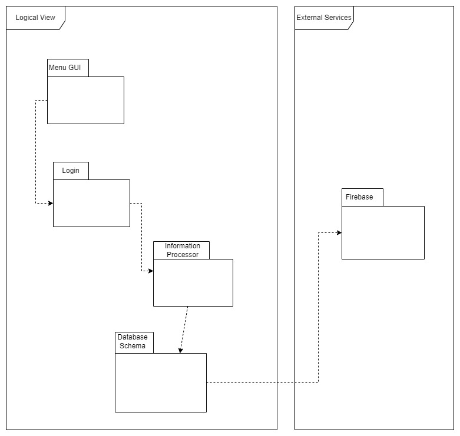
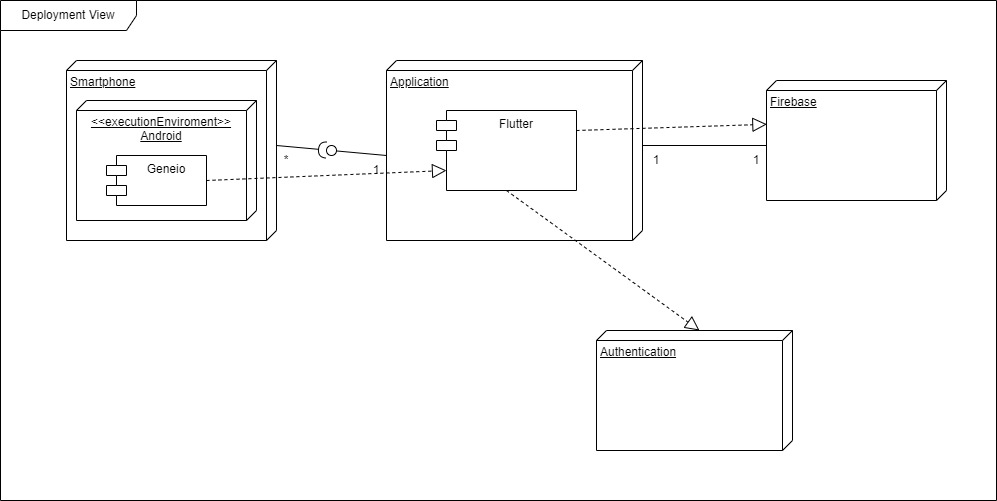

## Architecture and Design

### Logical architecture

Our application is divided into the following packages:

+ Menu GUI
+ Login
+ Information Processor
+ Database Schema
+ Firebase

  

### Physical architecture

The physical architecture of our project is divided in four main parts:
- The user mobile phone.
- An application that allows to check and add genealogical information.
- Authentication
- The Firebase

  

