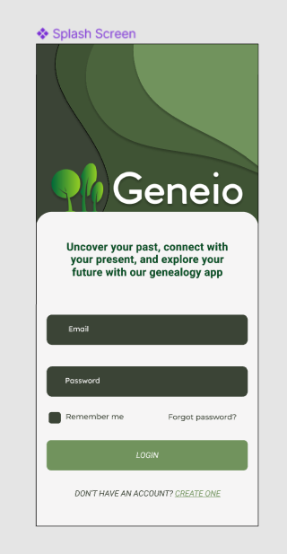
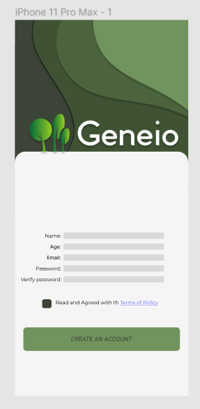
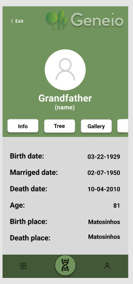
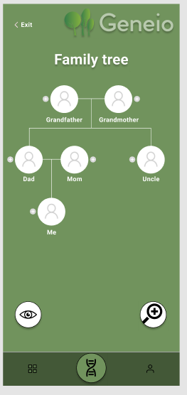
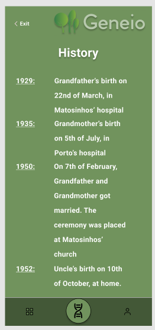
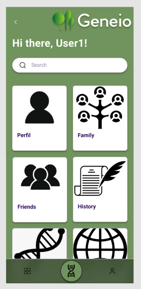
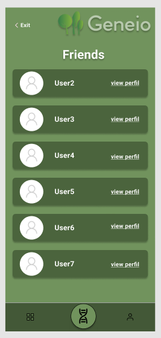

# User stories:
1.	Genetic probability calculation (up and down)
-	As a user of the genealogy app, I want to be able to calculate the probability of inheriting certain genetic traits or characteristics from my ancestors and potentially passing them on to my descendants, so that I can better understand my own genetic makeup and potential health risks.

2.	Family tree merge (request) or connection
-	As a user of the genealogy app, I want to be able to connect and merge family trees with other users or family members, so that I can build a more complete and accurate picture of my family history.

3.	Login/logout functionality
- As a user of the genealogy app, I want to be able to securely log in and out of my account, so that I can save my personal information and keep my family history data secure.

4.	Unique family identifier or key
-	As a user of the genealogy app, I  wanto to have the ability to modify sensitive information within my family tree, but only if I provide the unique family key, so that only authorized family members can access and modify the data, ensuring the privacy and security of our family history.

5.	Viewer mode functionality
-	As a user of the genealogy app, I want to be able to switch to a viewer mode that allows meview and navigate through other family trees, so that I can better understand the intergenerational connections and relationships outside my family history without risking changing their sensitive details.

6. Life events tracking and management
- As a user of the genealogy app, I want to be able to manage and track key life events and locations for my family members, including births, marriages, graduations, and deaths, so that I can gain a comprehensive understanding of my family history, including its geographical aspects. 

# Other UI Mockups:

## Menu

## Friends

# Acceptance tests:
1. Genetic probability calculation (up and down)
- Given that I am a user of the genealogy app
When I input my genetic information and my ancestors' genetic information
Then the app should calculate the probability of me inheriting certain genetic traits or characteristics from my ancestors and potentially passing them on to my descendants

2. Family tree merge (request) or connection
- Given that I am a user of the genealogy app
When I connect and merge my family tree with another user's family tree
Then the app should combine the two trees and display a more complete and accurate picture of my family history

3. Login/logout functionality
- Given that I am a user of the genealogy app
When I try to log in to my account with my correct username and password
Then the app should grant me access to my account
And when I log out of my account
Then the app should securely log me out and protect my personal information

4. Unique family identifier or key
- Given that I am an authorized family member with access to modify sensitive information
When I provide the unique family key
Then the app should allow me to modify the data
And when I don't provide the unique family key
Then the app should deny me access and protect the privacy and security of our family history

5. Viewer mode functionality
- Given that I am a user of the genealogy app
When I switch to viewer mode
Then the app should allow me to view and navigate through other family trees without the ability to modify their sensitive details

6.  Life events tracking and management
- Given that I am a user of the genealogy app
When I add or update a life event or location for a family member
Then the app should save and display the information in a clear and organized way
And when I search for a family member's life event or location
Then the app should provide me with accurate and relevant search results

# Domain Model:

  

- This diagram shows how our work is divided. First, our customer must have the possibility to create an account, for the sake of protection of information, so that they can choose what is private or not. So the class Customer has as attributes the usernameID and the password. 

- Next, we have a class named Menu which has only one attribute, the menuID. This class is a generalization, it has (for now) four submenus: MenuProfile, MenuFamily, MenuFriend and MenuHistory. The attributes of  MenuProfile class are profileID, name, age, name and definitions (this last one is going to be more detailed). 

- In MenuFamily class, we have as attributes familyID, name, key, root, startedAt and updatedAt. Every Family tree (MenuFamily) can have one or more people attached to it (Person class). 

- The Person class has as attribut id, firstName, lastName, gender, age, birthDate, deathDate, marrigedDate, birthPlace, deathPlace.
 
- The MenuFriend only has as attribute friendID. Similar to the MenuFamily class, it can have one or more friends. 

- The Friend class has id, treeViwer, firstName, lastName, gender, age, birthDate, deathDate, marrigedDate, birthPlace, deathPlace. 

- Finally, the MenuHistory has one attribute, which is historyID.
